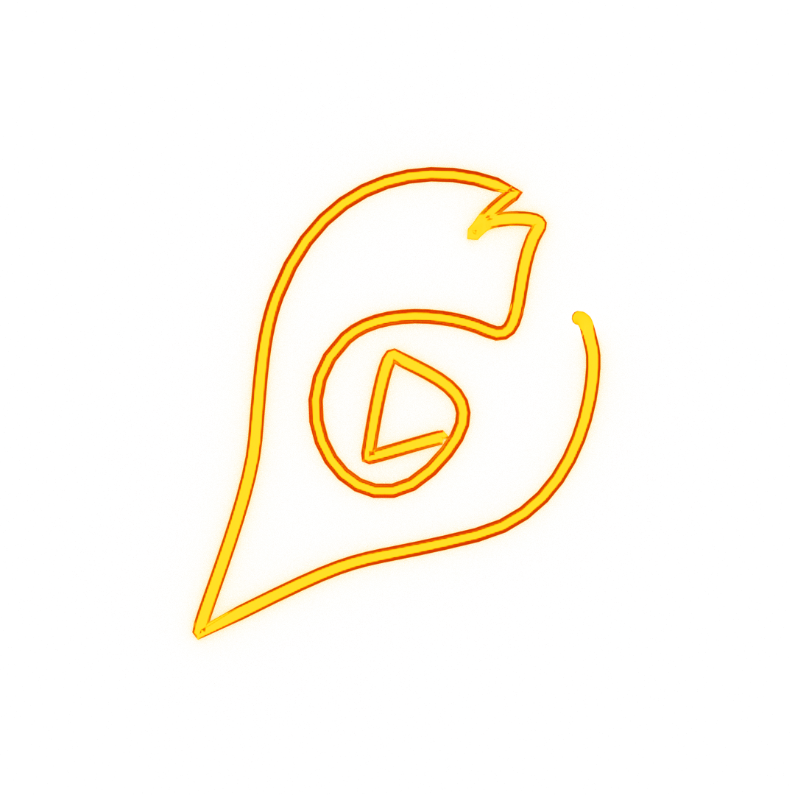
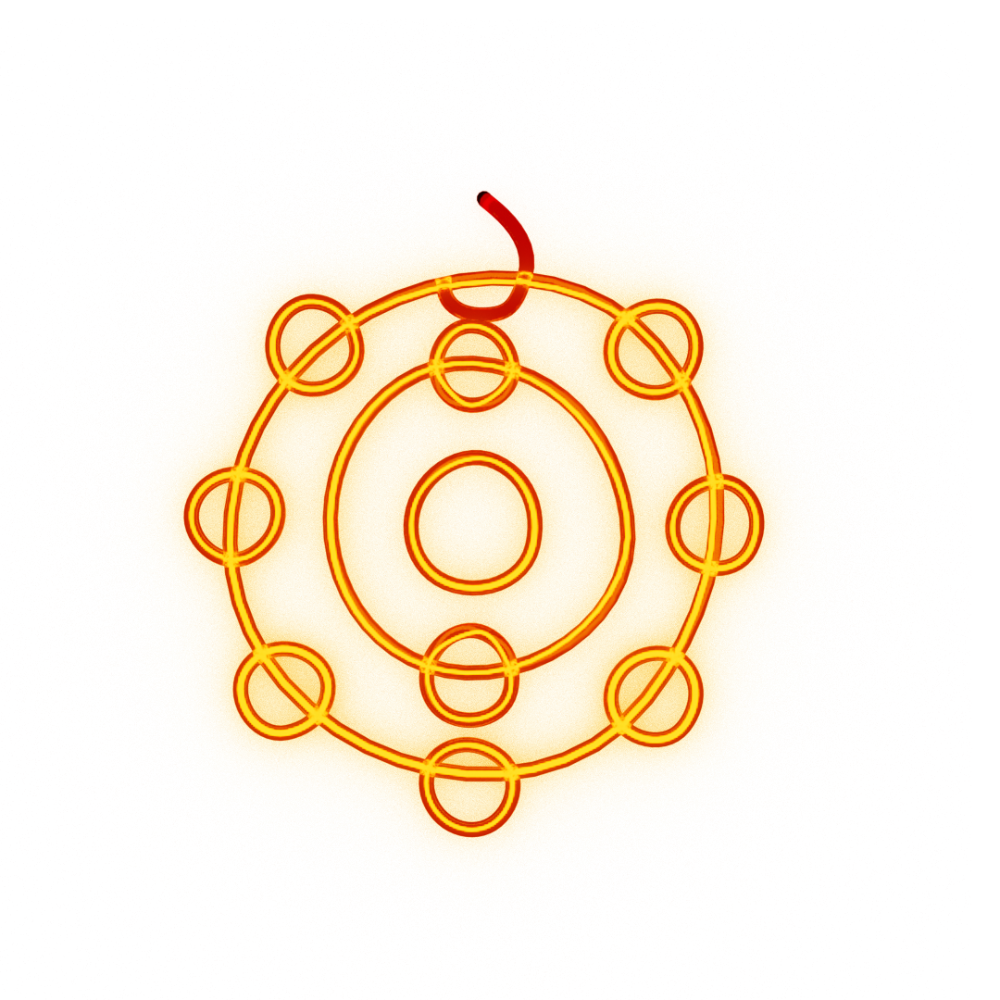

<h1>Hello, welcome to my Github profile!</h1>

<h2 align="center">I'm a guy that develops a variety of things</h2>

&emsp;My main language is Python but I've been trying to use C++, Julia, JS, etc... Well, I contribute to some small projects from people that I know and (try to) maintain my own projects (A big part of them are just experiments), I also used to be the main programmer of a robotics team and still create some tools for LEGO Robotics.

# PERSONAL
&emsp;You can call me Jonh (with the "nh"), I don't care about my pronouns and gender since I don't think it's important, I'm a furry, I like glowing things (including the noble gas neon), both cats and dogs, casual gaming and simplicity and ease of use, I talk about politics but only with my parents/close friends, and that's all.

# CONTACT

E-mail (I'm very inactive): joaovsanmiz@gmail.com

Discord: pyjonhact#6177

